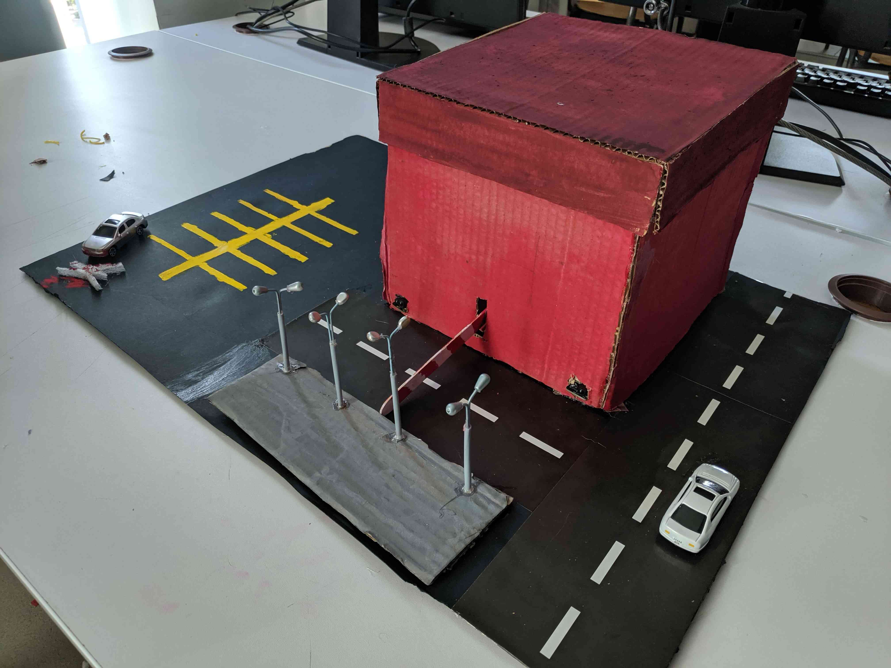
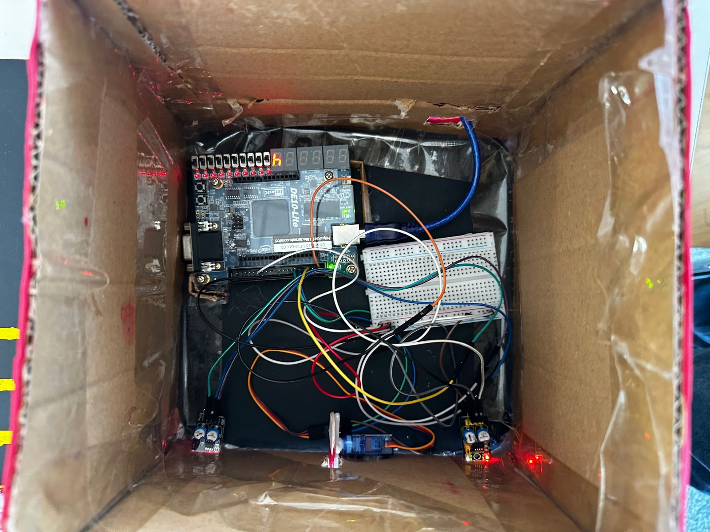
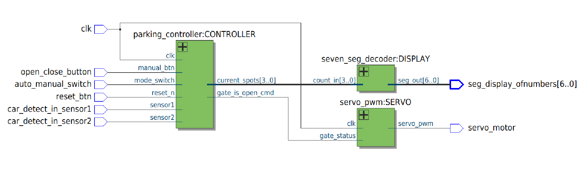

# Smart-Parking-System
A VHDL-based Smart Parking System that uses a DE10-Lite FPGA to manage an 8-spot parking lot. It uses two KY-032 IR sensors for vehicle detection and an SG-90 servo motor for gate movement. Features include a 7-segment display counter and a switch to toggle between manual and autonomous entry modes (CSEN 605: Digital System Design Course Project).

## 💡Project Idea
The idea of this project is to create a smart parking system. Initially, The number of empty spots is 8 and it works in 2 modes. The autonomous mode makes use of 2 sensors such that when the first sensor detects a car, the gate opens using a servo motor. The second sensor detects when a car has passed the gate. When it detects the presence of the car, the number of empty spots decrement by 1. The manual mode works by pressing a button which opens and closes the gate. When it closes the gate, it decrements the number of empty spots by 1. There’s also a reset button that when pressed, returns the counter to 8 in any mode. The logic for the program is done entirely in VHDL.

## 🔧Parts Used
* 2x **KY-032 Infrared Sensors**
* 1x **SG-90 Servo Motor**
* 1x **DE10-Lite FPGA**
* 1x **Breadboard**
* xx **Male-to-Female Wires**
* xx **Female-to-Male Wires**

## 📌Pin Assigments
| Signal Name | Pin | Input/Output | Description |
|     :---:      |     :---:      |     :---:      |     :---:      |
| clk        | P11        | Input        | 50MHz System Clock        |
| reset_btn        | B8       | Input        | Active Low. Resets the counter to 8 and closes the gate.|
| auto_manual_switch        | C10        | Input        | System mode: 1=Auto, 0=Manual        |
| open_close_button        | A7        | Input        | Active low. Button for opening/closing the gate.|
| car_detect_in_sensor1 | V10 | Input | Active Low. Entry Sensor (Detects car passing the gate)|
| car-detect_in_sensor2 | V8 | Input | Active Low. Exit/Pass Sensor (Detects car passing the gate)|
| servo_motor | W6 | Output | 20ns PWM signal to control the servo motor angle|
| seg_display_ofnumbers |  | Output | Active Low. 7 DOWNTO 0 Bit vector such that each bit maps to a distinct segment |

#### 7-Segment Display Pin Assignment
| Bit Vector | Pin |
|     :---:      |     :---:      |  
| seg_display_ofnumbers[0] | C17 | 
| seg_display_ofnumbers[1] | D17 | 
| seg_display_ofnumbers[2] | E16 | 
| seg_display_ofnumbers[3] | C16 | 
| seg_display_ofnumbers[4] | C15 |
| seg_display_ofnumbers[5] | E15 |
| seg_display_ofnumbers[6] | C14 |

## 👥 Team Members
* *Mario Gadallah* – [LinkedIn](https://www.linkedin.com/in/-mario-gadallah-/)
* *Yassin Mohamed Ahmed* – [LinkedIn](https://www.linkedin.com/in/yassin-moatasem-293109380/)
* *Amr Sharaf* – [LinkedIn](https://www.linkedin.com/in/amr-sharaf-240237373/)
* *Tony J* – [LinkedIn](https://www.linkedin.com/in/tony-j-0588003a4/)
* *Youssef Omar* – [LinkedIn](https://www.linkedin.com/in/youssef-omar-397930395/)
* *Ziyad Afifi* – [LinkedIn](https://www.linkedin.com/in/ziyad-afifi-7b2b1b195/)
* *Youssef Moussa*

